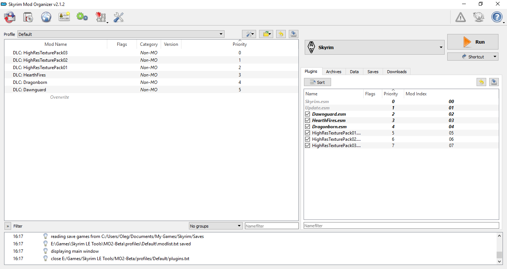
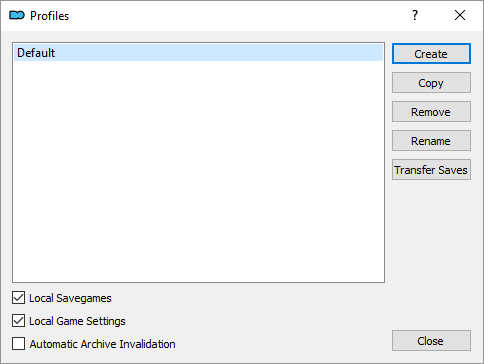
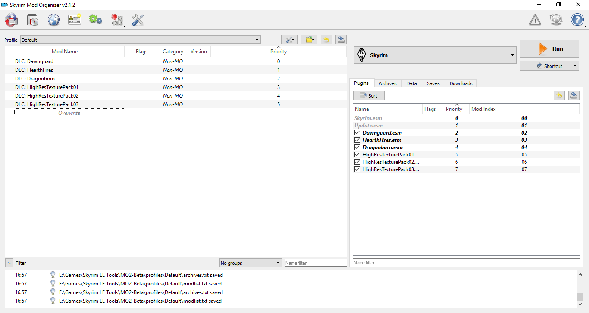
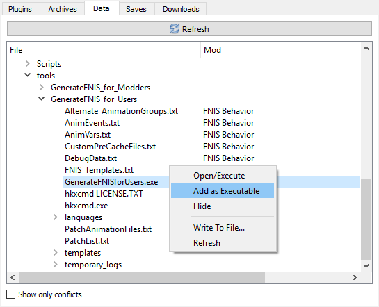
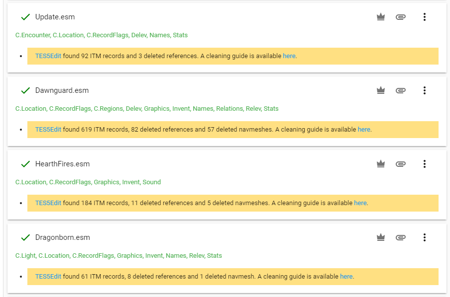
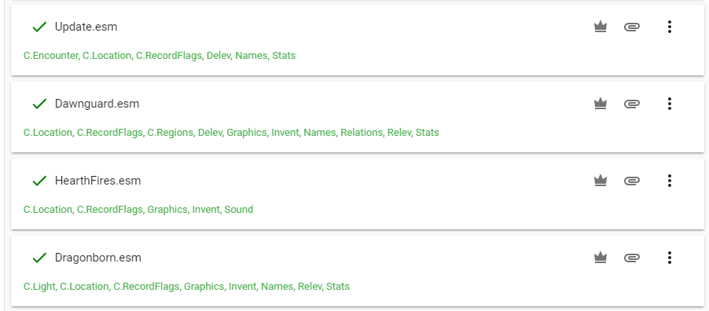
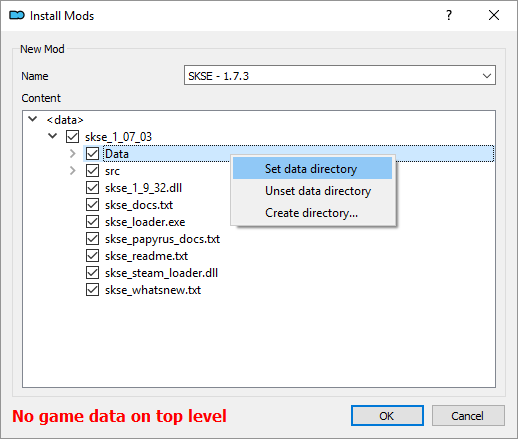
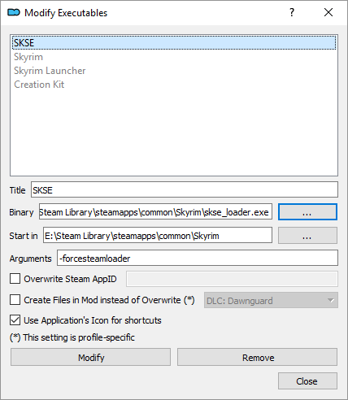
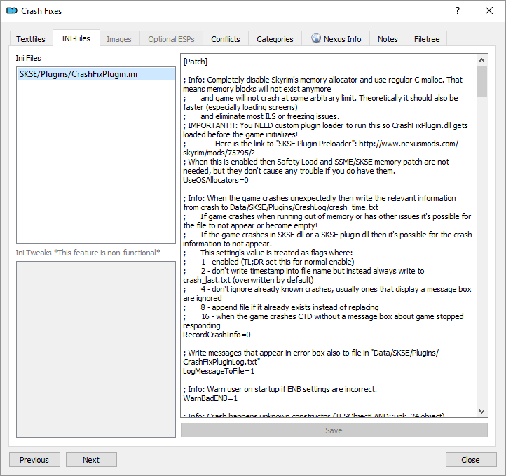
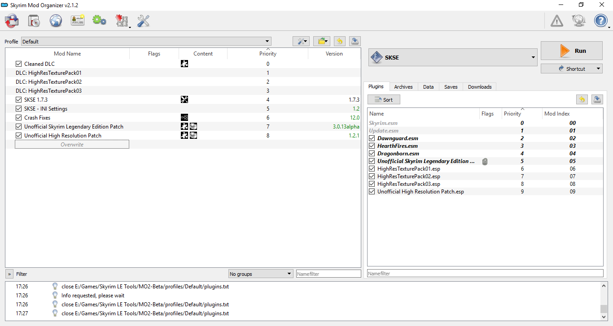

# Альтернативный старт-гайд (Beta)

## Содержание
+ [Скачивание/установка игры](#DownloadInstall)
+ [Дополнительные программы](#SkyrimTools)
+ [Подготовка игры](#Preparation)
+ [Запуск игры](#StartGame)
+ [Полезные советы](#GoodTips)
+ [Переход с МО1 на МО2](#Transition)

##  Скачивание/установка игры

1) Для начала убедись, что вычистил все следы предыдущей установки (если она была). Проверь папки Стима или куда ты ещё устанавливал Скайрим, проверь "Документы\My Games". Проверь установленные программы через Панель Управления или Reg Organizer или любую подобную софтину, вдруг он висит в списке.

2) Теперь выбор версии игры.
    + Если ставишь пиратку, убедись в её "нормальности". Версия должна быть 1.9.32.0.8, там должно быть 4 DLC (Dawnguard, Hearthfire, Dragonborn и High Resolution Texture Pack) и не должно быть больше ничего. Никаких предустановленных модов, фиксов и подобного. Некоторые аноны рекомендуют репак от "R.G. Механики".
    + Если ставишь Стим-версию, то просто не промахнись с языком (ПКМ ➔ Свойства ➔ Язык). Учти, что ссылки данной шапки почти всегда ведут на англоязычные ресурсы, поэтому при выборе русского языка поиском локализованных модов ты должен будешь заниматься самостоятельно.

3) Установка должна проводиться не на диск C. Нужен какой-нибудь D, E или где ты там держишь игрушки. Если ставишь пиратку, подойдёт "E:\Games", если из Стима - "E:\Steam Library". Поверь, это не спроста, на диске C (особенно в Program Files) часто возникают проблемы с правами записи. Для гайда будем считать, что ты ставишь Скайрим из Стима.

##  Дополнительные программы

1) Первое, что я хотел бы сказать: не рекомендую скачивать эти программы с русских сайтов типа GamerMods, ModGames и подобных. Кто знает, что они там навертели в настройках? Такое бывает довольно часто, васяны любят впаривать людям своевольно настроенный софт.

2) Этот софт можно спокойно качать, пока игра устанавливается, только не запускай. От себя я рекомендую Portable-версии, которые легче запихнуть в любую папку. Так и сделай: создай папку "E:\Games\Skyrim Tools", куда будешь кидать всё для работы с игрой.

3) Собственно, необходимые программы.
    + **Mod Organizer 2**. Это менеджер модов, который является лучшим решением для допиливания игры. Отличается отлично сделанной виртуализацией, которая позволяет устанавливать моды в отдельные папки, а значит и удалять их без следов. Спасает в случае возникновения проблем в игре, предоставляя возможность отключить проблемный мод без необходимости переустановки всех остальных модов, а то и игры. [Ссылка на скачивание (Nexus)](https://www.nexusmods.com/skyrimspecialedition/mods/6194/?) - выбирай крайнюю Standalone-версию.
    + **BethINI**. Программа для настройки инишников - файлов конфигурации, весьма полезная вещь. [Ссылка на скачивание (Nexus)](http://www.nexusmods.com/skyrim/mods/69787/?).
    + **LOOT**. Это сортировщик плагинов и не только. Может указать тебе на плагины, в которых есть ошибки - так называемые "грязные записи". [Ссылка на скачивание (Github)](https://github.com/loot/loot/releases/latest) - выбирай не Installer.
    + **TES5Edit**. Это программа для простого редактирования плагинов и относительно автоматической очистки их от "грязных записей", которые вам покажет LOOT. [Ссылка на скачивание (Nexus)](http://www.nexusmods.com/skyrim/mods/25859/?).
    + **Wrye Bash**. Ещё один менеджер модов, который может пригодиться тебе не для управления модами, а для создания Башед-патча. Эта штука делает несколько полезных вещей, в том числе объединяет уровневые листы разных плагинов. [Ссылка на скачивание (Nexus)](http://www.nexusmods.com/skyrim/mods/1840/?) - выбирай Standalone-версию.

4) Эти программы должны лежать по своим папкам в "E:\Games\Skyrim Tools". Типа "E:\Games\Skyrim Tools\BethINI", "E:\Games\Skyrim Tools\LOOT" и т.д. И пока Скайрим у тебя не установлен, не запускай их.

5) Mod Organizer 2 - программа особенная, использует для работы довольно спорный метод - перехват запросов системы. Из-за этого некоторые антивирусы могут мешать работе если не самого MO2, то некоторых приложений, запущенных из него. Добавь всю папку MO2 в список исключений своего антивируса. Если хочешь - сделай то же самое с папкой игры. Проверь также, чтобы у них обеих не стояла галка "Только чтение" (такого быть не должно, но вдруг).

**Внимание**: следование этому гайду не освобождает от необходимости изучения инструкций к программам.

##  Подготовка игры

1) Запусти Лаунчер игры. Если ты не создал ярлык на Рабочем столе, иди по адресу "E:\Steam Library\steamapps\common\Skyrim" и запусти SkyrimLauncher.exe. Дождись, пока он определит настройки графики для твоего ПК, а затем выйди из него без каких-либо других действий.

2) Теперь по адресу "Документы\My Games" должна оказаться папка Skyrim, а в ней 2 файла: Skyrim.ini и SkyrimPrefs.ini. Если они есть, то пока что всё идёт нормально.

3) Теперь запусти Mod Organizer 2, обязательно от имени администратора. Выбери режим Portable, игру Skyrim и обрати внимание на небольшую обучалку. Пройди её и по возможности запомни, она очень важна! В процессе укажи ассоциировать nxm-ссылки Нексуса с MO2. MO2 - это мощный инструмент, который требует некоторых навыков в обращении с ним.

4) Теперь ты должен увидеть перед собой примерно такую картину.

    

    По желанию можешь открыть окно управления профилями и поставить галку Local Savegames.

    

    Теперь открой редактор INI, встроенный в MO2 (Tools/INI Editor). Если там есть инишники (копии из Документов), то пока что всё идёт нормально. Но знай, в таком виде они далеки от нормальных, их нужно немного изменить. Закрой MO2.

5) Теперь запусти BethINI для настройки этих инишников.
    + Выбери игру Skyrim и иди на вкладку Setup. Проверь, чтобы там были правильно заполнены строки Game, Game Path и Mod Organizer. При правильно указанном пути к MO2 в строке INI Path можно будет выбрать профиль MO2, для которого ты будешь настраивать инишники. Выбери Default.
    + Далее перейди обратно на вкладку Basic, кликни BethINI Presets и выбери нужный пресет, затем поставь галку напротив Recommended Tweaks. Алсо, если ты в будущем планируешь использовать графические функции ENB, то отметь также ENB Mode (если же кроме ENBoost тебе ничего не нужно, не трогай эту опцию).
    + По желанию можешь изменить галки справа вверху - там оконный режим, FXAA (сглаживание), работа в фоновом режиме и вертикальная синхронизация. Наконец, кликни Save and Exit.
    + В дальнейшем тебе желательно донастроить эти инишники, следуя рекомендациям S.T.E.P. Вот [Skyrim.ini](http://wiki.step-project.com/Guide:Skyrim_INI), а вот [SkyrimPrefs.ini](http://wiki.step-project.com/Guide:SkyrimPrefs_INI), все изменения вноси через INI-редактор MO2, у него для каждого профиля свой набор файлов.

6) Теперь тебе надо расставить всё как следует. Запусти MO2 и укажи такой порядок: Dawnguard-HearthFires-Dragonborn-HD01-HD02-HD03.

    

7) Теперь тебе надо добавить используемые тобой программы в список MO2. Это нужно для того, чтобы они могли видеть моды, установленные через него. Нажми на 2 шестерёнки слева вверху и добавь LOOT и TES5Edit.

    > Вообще, все программы, которые обращаются к модам в процессе работы, должны запускаться через MO2. И небольшой совет на будущее: если тебе нужно добавить в MO2 программу, которая была установлена через него (это может быть FNIS или любой SkyProc-патчер), проще это сделать через вкладку Data прямо в MO2.

    

    > Как ты понимаешь, BethINI к таким программам не относится, т.к. она не обращается к модам - только к INI-файлам. Если ты запустишь её из MO2 и попытаешься изменить инишники в текущем профиле, у тебя просто ничего не получится - настройки не будут сохраняться. TL;DR - сначала закрывай MO2, потом запускай BethINI.

<b>

⚡⚡⚡  
Пункты с 8 по 10 обычным игрокам не нужны.  
Выполни их только если ты точно знаешь, для чего они, и тебе это необходимо.

</b>

8) Запусти LOOT через MO2 и убедись, что в плагинах DLC полно "грязных записей".

    

9) Чтобы исправить это, сделай следующее:

    Вариант-1, классический.  
        1) запусти TES5Edit через МО2, выбери один Update.esm, дождись конца загрузки (Background Loader: finished).  
        2) в левой части ПКМ по Update.esm ➔ Apply Filter for Cleaning, дождись окончания операции.  
        3) снова ПКМ ➔ Remove "Identical to Master" records, подтверди изменения в файле.  
        4) снова ПКМ ➔ Undelete and Disable References.  
        5) закрой TES5Edit, сохраняя изменённый Update.esm. По желанию можешь сделать бэкап - поставь галку Backup plugins.  
        6) повтори эти операции для каждого плагина DLC, а для Dawnguard - 2 раза. Да, 2 раза, такая вот морока.  

    Вариант-2, современный.  
        1) возьми ярлык xEdit в МО2 с обычным набором аргументов.  
        2) добавь ему аргумент "-quickautoclean" (без кавычек).  
        3) запусти программу и выбери плагин Update.esm (только его).  
        4) нажми ОК, дождись окончания операции, выйди из xEdit, сохранив плагин (и бэкап, если хочешь).  
        5) повтори операции 3-4 для каждого плагина, который нужно очистить.  

    Вариант-3, усложнённый.  
        1) Скопируй esm-файлы DLC и Update.esm в отдельный мод в систему МО2.  
        2) Назови мод "Cleaned DLC" или как-то похоже. Помести его первым в списке.  
        3) Проведи чистку, используя Вариант-1 или Вариант-2.  

    > Для чего это нужно? Чтобы не трогать ванильные esm, которые лежат в реальной папке Data. Решай сам, нужно ли это тебе, ведь игра обновляться не планирует. Всё будет работать и без этих сложностей.

10) Снова запусти LOOT и убедись, что теперь с плагинами всё в порядке.

    

<b>

Пункты с 8 по 10 обычным игрокам не нужны.  
Выполни их только если ты точно знаешь, для чего они, и тебе это необходимо.  
⚡⚡⚡

</b>

11) Теперь установка и настройка ENBoost. Настоящий маст-хэв, который необходим для разных операций в дальнейшем. Делай так:
    + скачай и установи [DirectX End-User Runtimes](https://www.microsoft.com/en-us/download/details.aspx?id=8109).
    + скачай последнюю версию [ENBSeries](http://enbdev.com/download_mod_tesskyrim.html).
    + в этом архиве открой папку WrapperVersion и возьми оттуда файлы d3d9.dll, enbhost.exe и enblocal.ini. Запихни их в корень игры, где лежит TESV.exe.

        > Если в будущем Wrapper будет неправильно работать (такое часто бывает у владельцев ноутбуков), следует использовать Injector. Из папки InjectorVersion возьми файлы ENBInjector.exe, enbinjector.ini и enbseries.dll, а из папки WrapperVersion - файлы enbhost.exe и enblocal.ini. При этом убери из папки игры файл d3d9.dll от Wrapper'а. В дальнейшем ты должен будешь запускать ENBInjector.exe перед каждым запуском игры и выключать его после выхода из игры.

    + открой enblocal.ini и поменяй значения:

        > UsePatchSpeedhackWithoutGraphics=true  
        > UseDefferedRendering=false  
        > ExpandSystemMemoryX64=false  
        > AutodetectVideoMemorySize=false

    + теперь очень важный момент: тебе нужно указать объём видеопамяти, который будет использовать игра. И ещё объём буфера. Это VideoMemorySizeMb и ReservedMemorySizeMb.
    + скачай [VRamSizeTest Tool](http://enbdev.com/download_vramsizetest.htm) и запусти вариант DX9.

        > Если у тебя есть и дискретная, и интегрированная видеокарты (от NVIDIA и от Intel, например), то по умолчанию утилита может использовать интегрированную и покажет неверное значение. Убедись, что запускаешь VRamSizeTest, используя свою "игровую" видеокарту.

    + если ты пользователь Win7, отними от полученного значения 170 и запиши результат в VideoMemorySizeMb. Если Win8 или Win10, то отними 350.
    + ReservedMemorySizeMb определяется не так просто. Начни со 128, а если во время игры будут "заикания" - подними, но не сильно. Значение может быть кратно 128.
    + По желанию можешь включить вертикальную синхронизацию: EnableVSync=true, VSyncSkipNumFrames=0. Но некоторые говорят, что лучше через настройки драйвера.
    + По желанию можешь включить оконный режим: ForceBorderless=true, ForceBorderlessFullscreen=true. Это очень даже рекомендуется, т.к. фиксит Alt+Tab.
    + Если ты умный и в целом хочешь знать, что делаешь, то читай описание каждой функции в [этой статье](../03_Texts_And_Links/08_Разбор_enblocal.md).

12) Теперь установка SKSE. Очень важная штука, которая требуется для огромной кучи модов.
    + Для начала закрой MO2.
    + Затем скачай архив по [этой ссылке](http://skse.silverlock.org/beta/skse_1_07_03.7z), открой его и возьми 3 файла:

        > skse_steam_loader.dll  
        > skse_loader.exe  
        > skse_1_9_32.dll

        Запихни их в папку с игрой, где лежит TESV.exe.
    + Теперь снова запусти MO2 и убедись, что в его списке исполняемых файлов появился SKSE.
    + Затем тебе надо установить некоторые файлы SKSE через MO2 как обычный мод. Для MO2 этот архив не совсем правильный, но это фиксится установкой папки Data как Data.

        

13) Довольно важный бонус SKSE - это файл SKSE.ini. Скачай его [отсюда](http://www.nexusmods.com/skyrim/mods/51038/?) (выбери обычную версию) и поставь через MO2. Файл должен выглядеть [вот так](../00_Resources/04_Содержимое_SKSE.ini.md).

14) Помимо всего этого, в аргументах к SKSE в MO2 нужно прописать -forcesteamloader. Это необходимо в любом случае, даже для пираток.

    

15) С недавних пор бессмертный мод для Скайрима - Crash Fixes. Главное его достоинство в том, что он изменяет механизм использования памяти игрой. Штука настолько хитрая, насколько и полезная.
    + скачай [SKSE Plugin Preloader](http://www.nexusmods.com/skyrim/mods/75795/?) и закинь файл d3dx9_42.dll из его архива в корень игры, где лежит TESV.exe.
    + скачай [Crash Fixes](http://www.nexusmods.com/skyrim/mods/72725/?) и установи его через MO2.
    + открой редактор INI Crash Fixes (двойной клик по моду, вкладка INI-Files).

        

    + поставь значения UseOSAllocators=1 и AlignHeapAllocate=1.

16) Ещё один бессмертный мод - Unofficial Skyrim Legendary Edition Patch или USLEEP. Неофициальный патч, который исправляет многие баги. Для английских игроков версия [здесь](http://www.nexusmods.com/skyrim/mods/71214/?), для русских можно взять на [GamerMods](http://gamer-mods.ru/load/tes_v_skyrim/patchi/usleep/46-1-0-3573).

17) Если ты собираешься играть с официальным паком текстур от Беседки, в дополнение к USLEEP тебе также требуется [Unofficial High Resolution Patch](http://www.nexusmods.com/skyrim/mods/31255/?).

18) Убедись, что у тебя всё выглядит примерно так (если ты не выполнял пункты с 8 по 10, то вместо Cleaned DLC у тебя просто будут указаны дополнения в порядке Dawnguard-HearthFires-Dragonborn, это нормально).

    

    И затем можешь создать ярлык SKSE у себя на рабочем столе, например. Для этого прямо под кнопкой Run есть Shortcut.

##  Запуск игры

1) Если ты создал ярлык из предыдущего пункта, запускай игру только через него. Если нет, то через MO2 и только SKSE.

2) Если всё нормально, повозка едет, а конокрад ссытся под себя, то можешь выйти из игры и начать накатывать моды. Не забывай читать описания, думать головой и ставить их только через MO2.

##  Полезные советы

1) Движок игры сбоит при FPS больше 60, поэтому последний нужно ограничить. Можешь сделать это, включив вертикальную синхронизацию в панели управления видеокарты, а можешь использовать сторонний софт - что даст лучший результат, то и используй.

##  Переход с МО1 на МО2

1) Установи MO2 как обычно, создай для него отдельную папку (не перезаписывай MO1).

2) Зайди в папку MO1 и скопируй/вырежи папки downloads, mods, overwrite и profiles (указаны все 4 на всякий случай).

3) Вернись в папку MO2 и вставь эти 4 папки со всем своим добром прямо в неё.

4) Когда копирование/перемещение будет завершено, запусти MO2 как обычно от имени администратора.

5) Проверь используемый профиль, его настройки, порядок модов и плагинов, а также настройки самого MO2 (не поленись пройти все вкладки).

6) Загляни в раздел Archives. Если там есть неактивные bsa-архивы, которые тебе нужны, подключи для них соответствующие плагины.

7) Добавь в MO2 исполняемые файлы (FNIS, DynDOLOD и т.п.) - заново и вручную.

8) Готово. Теоретически, MO2 теперь готов к работе. Папку MO1 можешь удалить/оставить (для нужных целей или в память о былых деньках).

------

|[*Назад к оглавлению*](../01_Оглавление.md)|
|:---:|
