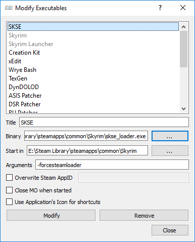

# Очень важные надстройки

**1)** [**SKSE**](http://skse.silverlock.org/) - скриптовое расширение, без которого накроется приличная часть модов. Также у тебя в МО должен быть мод со структурой "SKSE\SKSE.ini" - создай его сам или скачай [готовый](http://www.nexusmods.com/skyrim/mods/51038/). В любом случае, содержание SKSE.ini должно быть примерно [таким](https://raw.githubusercontent.com/Meridiano/SkyrimHead/master/00_Resources/05_Содержимое_SKSE.ini.md). Далее пропиши -forcesteamloader в свойствах программы.

Теперь тебе нужно будет запускать SKSE через МО, чтобы играть.
Наконец, можешь создать ярлык SKSE на рабочем столе через выпадающее меню.

------

**2)** [**SkyUI**](http://www.nexusmods.com/skyrim/mods/3863/) - мод, обязательный для большинства других модов, поскольку добавляет возможность их настройки через специальные меню (MCM). К тому же ванильный интерфейс может понравиться только консольщику, а сабж приводит его в божеский вид. Если же хочешь иметь МСМ, но оставить оригинальный интерфейс - то ставь к нему [SkyUI-Away](http://www.nexusmods.com/skyrim/mods/29440/).

------

**3)** [**ENBoost**](http://wiki.step-project.com/ENBoost) - позволяет использовать фиксы производительности из ENB без самих графических фич (если же ты хочешь установить именно ENB, то читай [здесь](http://wiki.step-project.com/Guide:ENB)). Если не можешь в английский, есть [краткий гайд](http://tesall.ru/topic/19689-nastroyka-enboost/) и [разбор enblocal.ini](http://tesall.ru/topic/19670-nastroyka-i-razbor-funkciy-enblocal-ini/) на русском.

------

**4)** [**Crash Fixes**](http://www.nexusmods.com/skyrim/mods/72725/) - SKSE-плагин, предотвращающий некоторые краши и добавляющий возможность использовать больше памяти для игры (для этого включи аллокаторы, которые изменят механизм использования памяти, делается это [вот так](../00_Resources/06_Настройка_Crash_Fixes.md)).

------

**5)** [**BethINI**](http://www.nexusmods.com/skyrim/mods/69787/) - утилита для настройки инишников, имеет более качественные пресеты, дружит с МО.

------

**6)** [**USLEEP**](http://www.nexusmods.com/skyrim/mods/71214/) - неофициальный патч, исправляющий огромную гору багов. Если предпочитаешь русский язык, локализации есть на [RiotPixels](http://tes.riotpixels.com/mods/skyrim/patches/usleep.shtml) и [GamerMods](http://gamer-mods.ru/load/tes_v_skyrim/patchi/usleep/46-1-0-3573). Если хочешь играть с High-Res DLC, то тебе также нужен [вот этот патч](http://www.nexusmods.com/skyrim/mods/31255/).

------

|[*Назад к оглавлению*](../01_Оглавление.md)|
|:---:|
