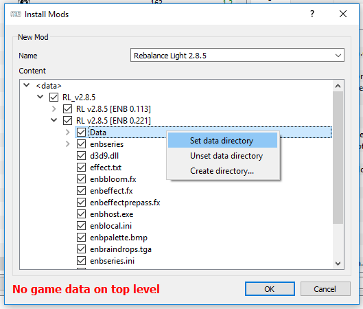
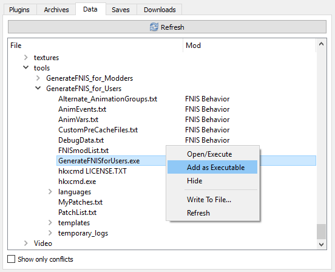

# Некоторые вопросы и ответы

В: С чего мне начать?

О: С чтения шапки, это даже не обсуждается. Читай вдумчиво, по пути составляя план дальнейших действий. [*Альтернативный старт-гайд*](../01_Minimum/04_Альтернативный_старт_гайд.md) поможет тебе сделать шаги в правильном направлении, но это не значит, что чтение шапки нужно забросить после его прохождения.

------

В: У меня игра вылетает/лагает, ещё и куча багов!

О: Читай шапку, поскольку с высокой вероятностью твои проблемы - результат игнорирования написанного. Если же всё необходимое стоит и настроено, то пили модлист, ибо телепаты в отпуске.

------

В: Почему в шапке нет мастхэв-модов?

О: Они есть - ты ставишь их во время прохождения гайда. Всё остальное является вопросом предпочтений. Ты всегда можешь спросить в треде - тебе дадут интересные (по мнению анона) ссылки. Кроме того, есть тематические подборки, и ещё некоторые моды упомянуты в других разделах.

------

В: Неофициальный патч не нужен, от него нет толку (или больше вреда, чем пользы)!

О: Если ты его удалишь, то во время игры возможно наткнёшься на что-нибудь забагованное, но исправленное в патче - в этом случае тебя ждёт сюрприз: при установке неоф. патча желательно начинать новую игру, т.к. многое говно оседает в сейвах.

------

В: Что лучше, [Мод А] или [Мод Б]?

О: Довольно сложный вопрос, т.к. это дело вкуса. Да, есть моды, которые рекомендованы разными мододелами, есть и такие, которые обладают дурной славой. О них будет сказано отдельно. Выбирать за тебя цвет штанов анон не будет.

------

В: Что лучше использовать - Nexus Mod Manager или Mod Organizer?  
В: Почему все говорят, что Mod Organizer несравнимо лучше остальных мод-менеджеров?

О:
+ Представь, что ты пришёл обедать в кафе "Му-Му". Ты хватаешь поднос и, проходя мимо еды, берёшь её вместе с тарелками. В одной тарелке салат, в другой картошка, пиво в кружке, подарочная конфетка в обёртке. Всё разделено, но лежит на одном подносе. Это система МО, когда все моды лежат по своим папкам.  
+ Теперь представь такую картину: вместо подноса ты берёшь небольшого размера тазик и сбрасываешь в него вперемешку резаные помидоры, огурцы и пару котлеток с пюрешкой. Затем щедро поливаешь всё это пивом и победно ложишь-кладёшь сверху голую ириску. Есть можно, но зачем такое надо? Этот тазик - твоя папка Data с модами, если ты не используешь МО в качестве основного мод-менеджера.

------

В: Я написал, а все молчат. Отвечайте мне!

О: Это тематика, а не /vg/. Жди, и тебе обязательно ответят.

------

В: Нет, я лучше новый тред для своего вопроса создам!

О: Тогда, конечно, аноны отпишутся сразу. Скажут, чтобы ты шёл в тред модамидопиливающих и накинут сажи.

------

В: Я поставил сборочку от Васяна, и у меня возникла проблема...

О: Мы не ставим сборки, не советуем их и не разбираем их проблемы. Для этого есть сам автор сборки - обратись к нему.

------

В: Предметы начинают скакать по помещению, когда я открываю двери, etc.

О: Это баг физики Скайрима, залочь FPS на 60. Как? Гугли, есть куча способов, выбери какой больше нравится.

------

В: Mod Organizer выключает моды, и мне приходиться подключать ёбаную кучу модов заново при каждом запуске.

О: SkyrimPrefs.ini (открывать через ini-редактор МО), раздел [Launcher], bEnableFileSelection=1.

------

В: Если я запускаю игру через Mod Organizer, она открывается в маленьком окне, т.е. не на весь экран.

О: У MO свои инишники Skyrim.ini и SkyrimPrefs.ini, поэтому в части [*Основной порядок действий*](../01_Minimum/03_Основной_порядок_действий.md) есть пункт 5. Он очень важен, читай!

------

В: Я поставил несколько модов и часть игры теперь на английском, что за хрень?

О: Практически все моды на Нексусе - на английском (кроме переводов), чего ты ожидал? Ищи русские варианты на русских сайтах.

------

В: Ставлю мод через МО, а он пишет "Нет игровых данных на верхнем уровне".

О: Ищешь в открытом моде папку Data, кликаешь правой кнопкой и выбираешь "Установить как каталог с данными":

------

В: Другие программы не видят моды, которые я установил через МО.

О: Программы, которые в процессе работы обращаются к твоим модам (Wrye Bash, LOOT и т.д.) должны запускаться через МО. Для этого программу нужно добавить в него: нажми на значок с двумя шестерёнками, после чего в поле "Исполняемый файл" укажи полный путь к файлу программы. Если она была установлена через МО (например, FNIS), то в виртуальной папке Data (средняя вкладка) найди нужный файл (exe/jar/т.п.), сделай по нему правый клик и выбери "Добавить как исполняемый".

------

В: При запуска LOOT'a через МО появляется белый экран и ничего больше не происходит.

О: Пропиши LOOT'у аргумент `--single-process`.

------

В: ENB Wrapper или ENB Injector?

О: Wrapper. Injector используется только если есть проблемы с работой Wrapper'а. Также в случае использования Injector'а необходимо запускать его экзешник перед запуском самой игры. При этом экзешник сворачивается в системный трей, так что не забывайте закрывать его после выхода из игры.

------

В: Поставил ENB - участились вылеты.

О: Кури [гайд по оптимизации и стабилизации ENB](http://www.nexusmods.com/skyrim/mods/50214/?).

------

В: Как сделать движение теней от Солнца более плавным?

О: [Вот так](../00_Resources/06_Плавные_тени_от_Солнца.md).

------

В: Как пофиксить квадратные тени?

О: Смотри твики теней: [Low](http://www.nexusmods.com/skyrim/mods/19632/?), [Medium](http://www.nexusmods.com/skyrim/mods/283/?) и [Ultra](http://www.nexusmods.com/skyrim/mods/7638/?). Читай гайды и правь конфиги ВНИМАТЕЛЬНО, это не беседковский гуй с тремя ползунками.

------

В Начинает тормозить игра с ENB, когда дым слишком... плотный.

О: Попробуй поставить [Particle Patch и Subsurface Scattering Patch](http://enbseries.enbdev.com/forum/viewtopic.php?f=6&t=1499).

------

В: Как пофиксить колчаны со стрелами и болтами в километре от тела?

О: Рекомендуем XPMSE (скелет) и RaceMenu (ползунки). С ними можно повесить колчаны почти куда угодно под любым углом и т.д.

------

В: При накатывании HDT-тела с коллизиями резко падает ФПС, чем ближе к другим неписям - тем сильнее.

О: Найди файл "Data\SKSE\Plugins\hdtPhysicsExtensionsDefaultBBP.xml", найди там "NPC PreBelly" и замени на "HDT Belly".

------

В: ОП-пик - говно.

О: ОП-пик не имеет значения, единственные требования: отношение к Скайриму и вырвиглазность меньше 90%.

------

В: Ваша шапка - говно, вы ничего не понимаете в шапках.

О: Нет конструктивных предложений = иди на хуй.

------

|[*Назад к оглавлению*](../01_Оглавление.md)|
|:---:|
